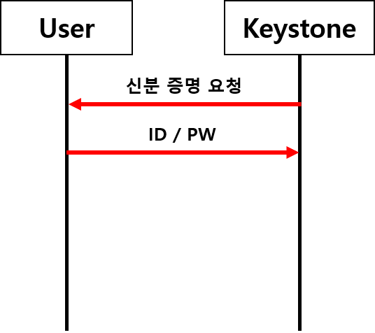
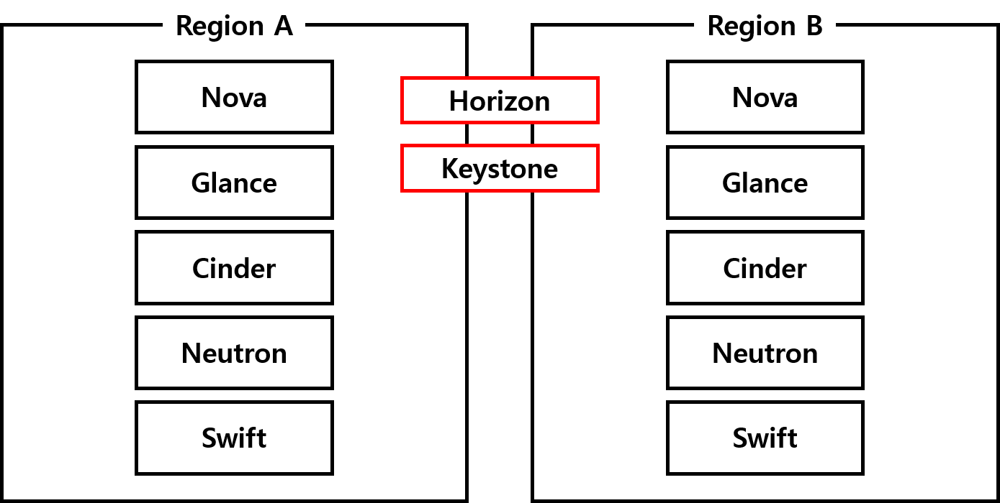
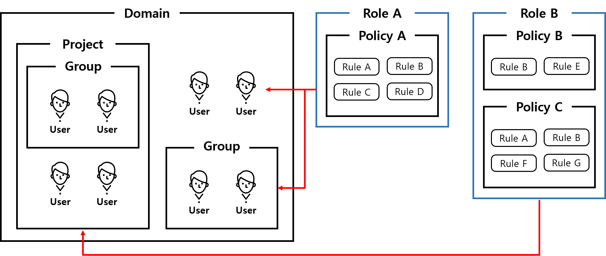

# Openstack Tenant 및 Identity 관리

 
<h2>목차</h2>

- Keystone은 무엇인가?
- Region / Domain / Project의 개념
 

---

 
<h2> Keystone은 무엇인가?</h2>

 

Keystone은 Openstack의 인증을 담당하고 있습니다.  
Openstack의 백엔드에서 **RBAD(Role Based Access Control)을** 통해 사용자의 접근을 제어하는 등의 인증(Identify) 서비스로 사용됩니다.  
(참고 : 인증 컨셉 https://docs.openstack.org/keystone/latest/admin/identity-concepts.html)
 

어떤 서비스를 설치하더라도 가장 먼저 설치가 되는 가장 중요한 서비스이며, Keystone이 없으면 그 어떤 서비스도 이용할 수 없습니다.

 

따라서, 이렇게 생각을 해볼 수 있습니다.

 

Openstack이 집이라면 Keystone은 **현관문 키와 같은 기능**을 하는 것이 아닐까?  

 

Openstack이라는 집은 물리서버로 구성되어 있고, **집 안에는 Compute, Image, Network, Storage와 같은 자원들이 있다고 가정해봅시다.**

 

 

 

이러한 자원들이 우리가 평소에 사용하는 가전제품이라고 한다면  
Openstack이라는 집에 들어가야만 사용할 수 있습니다.

 

즉, 내돈내산 가전제품들을 집 주인과 손님만 사용할 수 있습니다.  
이렇듯 **Openstack이 제공하는 서비스들도 동일하게 아무나 사용할 수 없습니다.**

 

그렇기 때문에 집 주인과 손님이라는 인증을 받아야만 해당 가전제품(자원)들을 사용할 수 있는데,  
Keystone이 해당 부분을 담당하고 있다고 생각하면 이해가 편합니다.

 

**결과적으로 Keystone은 사용자 인증을 통하여 물리 서버내의 자원을 사용할 수 있도록 관리합니다.**

 
 
 

> <h3>Logical Architecture로 보는 Keystone</h3>

 

이번에는 논리적인 구조를 통해 Keystone에 대해 한번 더 알아보겠습니다.  
* Keystone은 **서비스 및 관리자 API, Token Backend, Catalog Backend, Policy Backend, Identity Backend**의 구조로 되어 있습니다.

 

 

 

+ **Token Backend** : 사용자의 임시 토큰(Openstack 서비스에 접근하기 위한 신분 증명 데이터)을 관리
+ **Catalog Backend** : 모든 Openstack 서비스에 대한 End-Point URL 관리(Openstack client에서 Openstack Service 접근을 위한 정보)
+ **Policy Backend** : 사용자 및 권한 등에 대한 Role을 관리
+ **Identity Backend** : 사용자 및 그룹에 대한 인증을 관리

 
 

> <h3>Keystone의 구성요소</h3>

(참고 : https://docs.openstack.org/keystone/latest/getting-started/architecture.html)
 
 

**1. User**
   + 사람 또는 Openstack 서비스를 이용하는 서비스(nova, neutron, cinder 등)를 의미
   + User는 특정 프로젝트에 할당할 수 있으며, 중복을 허용하지 않음
 

**2. Authentication**
   + 사용자의 신분을 확인하는 절차로, 특정 값을 통해 Keystone이 이를 검증
   + 보통 인증을 위한 자료로는 ID, PW가 사용되며 Keystone은 인증확인 시 인증토큰을 발행
 

**3. Token**
   + RBAD의 신분을 증명하기 위해 사용되는 데이터
   + Token Type : uuid, fernet, pki, pkiz
   (참고 : https://docs.openstack.org/newton/admin-guide/identity-tokens.html)
   + Token Type에는 어떤 자원에 접근이 가능한지 범위가 지정되어 있음
  
 
 **4. Project(Tenant)**
 + Keystone V2까지 Tenant라는 이름으로 사용(V3 이후 Project)
 + 어떤 자원이나 애플리케이션에 대한 권리를 가진 보안그룹
 + 프로젝트는 특정 도메인에 의해 소유
  
 
 **5. End-Point**
 + 서비스를 이용하기 위한 네트워크 주소로 URL(IP, PortNum)을 사용
 + End-Point 유형
   - **admin** : 클라우드 환경을 관리하는 조직 내부의 운영자들에게만 접근이 허용
   - **internal** : 내부 서비스간에만 접근이 허용
   - **public** : 인터넷에서 인식이 가능하며, 사용자들이 인터넷을 통해 자신의 클라우드 환경을 제어할 때 사용
 

**6. 역할(Role)**
+ 사용자가 어떤 동작을 수행하도록 허용하는 집합
+ 사용자가 가지는 **역할은 사용자에게 발행된 Token에서 찾을 수 있음**
+ **사용자가 서비스를 호출하면, 서비스는 Token에 저장된 사용자의 역할을 해석하여 허용할지를 결정**
 

**7. 도메인**
+ 구성요소들을 효과적으로 관리하기 위해 활동 범위가 제한된 User, Group, Project의 집합
+ 사용자들은 한 도메인의 관리자로 권한을 부여받을 수 있고, 그 관리자는 도메인 내에서 Project, User, Group을 생성할 수 있으며 역할을 부여할 수도 있음
 
 

> <h3>Openstack에서 Keystone의 위치</h3>
> 
 

이번에는 Openstack에서 Keystone의 위치를 알아볼까 합니다.
 

 
 

Openstack에서 Keystone은 모든 서비스를 관장하는 위치에 자리잡고 있습니다.  
모든 User, Service는 Keystone의 인증을 통해서만 요청, 응답이 가능합니다.
 

그리고 **타인이나 해커로부터 시스템을 안전하게 보호하고, 사용자 등록 및 삭제, 권한 관리, 사용자가 접근할 수 있는 서비스 포인트 관리까지 사용자 인증에 대한 모든 관리**를 Keystone이 수행하고 있습니다.
 
 
 

그렇다면, Keystone이 어떻게 사용자와 서비스 인증 부분을 관리하는지 알아보겠습니다.
 

 

사용자일 경우에 **사용자 그룹인 Tenant, 사용자 계정 정보인 User(ID, PW), 사용자 권한인 Role**을 가집니다.
 

반대로, 서비스일 경우에는 **서비스를 등록하고 해당 서비스의 End-Point URL을 등록**합니다.
 

위의 내용을 바탕으로 정리하자면  
- Tenant에는 User가 포함
- User는 Role을 가지고 있음
- Token을 발행할 때 Tenant와 User 정보가 필요
- 서비스가 있고, 각각의 서비스는 End-Point URL을 가짐
- User는 End-Point URL을 통해 서비스에 접근

 
 
 

Token과 Tenant, User, Role의 관계는 파악을 한 상태이기 때문에  
실제로 Keystone어떤 절차를 통해 동작하는지 알아보겠습니다.
 
 

> <h3>Keystone 동작 절차</h3>

(참고 : https://galid1.tistory.com/207)

 

**1. User가 Keystone으로부터 범위 비지정(Unscoped) Token 획득**
   - User는 Nova 서비스가 제공하는 VM을 이용하기 위해 Keystone에 접근
   - Keystone은 User에게 **신분 증명을 요구**
   - User는 ID, PW를 제출하여 신분을 증명
   - Keystone은 인증에 성공한 User에게 **Unscoped Token을 발급**  
   (현재 Token에는 User가 사용가능한 서비스들에 대한 범위가 포함되어 있지 않음. 따라서 다른 서비스들에 접근이 불가능)
 

 
 

**2. Keystone이 User가 접속 가능한 프로젝트 조사**
   - 신분 증명을 완료하여 Unscoped Token을 받은 User는 해당 Token을 통해 자신이 접속 가능한 프로젝트를 요청
   - Keystone은 User에게 할당된 Role에 따라 프로젝트의 종류와 수행 가능한 End-Point 목록을 작성  
   (현재 단계에서는 User에게 End-Point 목록이 전달되지 않은 상태)
 

 
 

**3. User가 Keystone으로 부터 범위 지정 토큰(Scoped Token) 획득**
- **Keystone은 User가 접속 가능한 프로젝트 목록과 User가 사용을 원하는 프로젝트를 결정**
- 위의 정보(프로젝트와 Role)가 포함된 Token을 User에게 보냄
 

 
 

### **※ 4~7번의 과정은 서비스 수행 요청마다 진행**

 

**4. User가 서비스에게 수행 요청**
- 범위가 지정된 Token을 받은 User는 Token 내부의 End-Point를 확인하고 서비스에게 수행을 요청
 

 
 

**5. 요청을 받은 서비스가 Keystone에게 Token 검증 의뢰**
- 서비스는 User가 요청과 함께 제출한 Token의 메타데이터 정보가 유효한지 검증하기 위해 Keystone에게 의뢰
- Keystone은 서비스로부터 받은(User가 서비스에게 제출한) 메타데이터와 Policy Backend에 저장된 메타데이터와 비교(RBAC)
 

 
 

**6. 검증이 완료된 Token을 서비스에게 제공**
- User가 요청한 서비스에 접근이 가능한지 Token의 메타데이터 검증을 마친 Keystone은 그 결과를 서비스에게 제공
 

 
 

**7. 서비스가 User의 요청 실행**
- 서비스는 Keystone으로부터 Token 검증을 완료한 후 인스턴스를 실행하거나 볼륨을 생성하는 등의 요청을 수행

 
 

**8. 작업에 대한 응답**
- 서비스는 User의 요청에 대한 수행 결과를 응답
 

 
 
 
 

## Open stack 서비스는 자원을 어떤 단위로 관리할까?

### Region / Domain / Project의 개념
 

> #### Region
 

(Region 사용법 : https://docs.openstack.org/python-openstackclient/rocky/cli/command-objects/region.html)
 

 

Region은 다른 Region과 Identity(Keystone)만을 공유하는 전용 API End-Point를 가진 별개의 Openstack 환경입니다.
 

그리고 아래에서 설명할 Domain의 집합이기도 합니다.
 
 
 
 

> #### Domain
 

(Domain, Project, User, Role 생성 : https://docs.openstack.org/mitaka/ko_KR/install-guide-rdo/keystone-users.html)
 

 

Domain은 위에서 설명했었지만, User 및 Group, Project의 모음으로, 특정 조직을 격리할 수 있습니다.
 

현재 Keystone에서는 Default라는 이름의 기본 Domain을 제공합니다.
 

각 Domain은 특정 API 이름 속성이 존재하는 Namespace를 정의하며, Identity v3 API 속성의 고유성은 아래와 같습니다.
- Domain Name : 모든 Domain에서 고유해야 함
- Role Name : Domain 내에서 고유해야 함
- User Name : Domain 내에서 고유해야 함
- Project Name : Domain 내에서 고유해야 함
- Group Name : Domain 내에서 고유해야 함
 

Domain 관리자는 Domain에서 Project 및 User, Group을 만들고 Domain의 User 및 Group에 Role을 할당할 수 있습니다.
- Domain의 User는 적절한 할당이 부여된 경우, 다른 Domain 자원에 접근이 가능
    

> #### Project(Tenant)
 

Project(Tenant)는 Identity v2까지 Tenant라는 용어로 불렸지만, 개념적 표현보다는 직관적인 표현으로 표기하기 위해 Identity v3부터 Project라는 용어로 변경되었습니다.
 

Project란 Openstack 서비스 리소스(Server, Image 등 - Project 및 Domain에 데이터 제공)를 그룹화하고 격리(기본 소유권 단위)하기 위해 추상화되어 있으며, Project는 Domain에서 고유해야 합니다.  
Project의 Domain을 지정하지 않으면 Default라는 기본 Domain에 추가됩니다.
- Identity API v3.4 이후, Project 생성시 Project 계층 구조(parent_id)를 생성할 수 있으며, 계층 구조의 모든 Project는 동일한 Domain에서 소유해야 합니다.
- **Identity API v3.6 이후, Project는 Openstack 리소스에 대한 컨테이너 역할을 하는 것 외에도 Domain 역할을 할 수 있습니다.**
 

Keystone의 가장 근본적인 목적은 Project의 Registry와 접근 가능 여부가 명확해야 합니다.
 

Project는 User 또는 User Group을 Role 할당 개념으로 사용하여, Project 리소스에 대한 접근 가능 권한을 부여할 수 있습니다.  
권한이 부여된 User는 특정 Role에 따라 접근 유형 및 기능이 결정됩니다.
    

위에서 나온 내용을 한 번 더 복습해봅시다.
 
 

> #### User와 Group
 

User는 Openstack 서비스를 이용하는 사람 또는 서비스(Nova, Cinder 등)를 의미하며, Domain 내에서 고유해야 합니다.
 

Group은 User 집합을 의미하며, Domain 내에서 고유해야 합니다.
    

> #### Role
 

User 및 Group에게 Role을 할당하여 Project 리소스에 접근할 수 있는 집합을 의미하며, Role은 User에게 발행된 Token에서 확인할 수 있습니다.
    

> #### Token
 

Token은 Openstack API 및 리소스에 접근하기 위한 영숫자 텍스트 문자열입니다.
 

Token은 언제든지 취소할 수 있으며, 한정된 기간 동안만 유효합니다.
 
 
 
 

## 참고

> #### Token  
 
(Openstack docs, Keystone Token : https://docs.openstack.org/keystone/latest/admin/tokens-overview.html) 
 
 

위에서 Keystone 동작 절차에 대해 설명할 때 Unscoped Token, 범위가 지정된 Token 개념이 나왔었는데, 해당 부분에서 조금 더 자세히 다뤄볼까 합니다.
 
 

> 권한 부여 범위
 

Token은 Role 할당 정보를 전달하는데 사용됩니다.  
User는 Project, Domain 또는 전체 시스템에 걸쳐 여러 Role을 가지고 있는 것은 자주 있는 일입니다.  
이러한 범위를 **권한 부여 범위**라고 합니다.
 

여기서 Token은 단일 작업 범위(ex. Project, Domain 또는 시스템)를 가지기 때문에, 만약 Project로 범위가 지정된 Token은 다른 Project에서 다른 작업을 수행하기 위해 재사용할 수 없습니다.
 

따라서, 각각의 권한 부여 범위는 특정 Openstack 서비스에서 특정 유형의 작업에서만 유용하며 상호 호환되지 않습니다.
 
 
 

**<h3>1. 범위가 지정되지 않는 Token(Unscoped Tokens)</h3>**
 

Unscoped Token은 서비스 카탈로그, Role 또는 권한 부여 범위(ex. Token 내의 Project, Domain 또는 시스템 속성)가 포함되지 않습니다.  
 

      주요 사용 사례로는 원본 자격 증명을 반복적으로 제시하지 않고 나중에 Keystone에 Identity를 증명(범위가 지정된 Token 생성)하는 것이 있습니다.
 

Unscoped Token을 받기 위해서는 아래와 같은 조건이 만족되어야 합니다.
- 인증 요청에 권한 부여 범위를 지정하지 않아야 합니다.
(ex. --os-project-name 또는 같은 인수가 있는 명령 줄에서 --os-domain-id)
- Identity에는 Role 할당 및 권한 부여와 관련된 "기본 프로젝트"가 없어야 합니다.

<!--stackedit_data:
eyJoaXN0b3J5IjpbLTIwMTk2ODc2MzYsMTk0MTE4Njk0MSwxNz
Y0NTY1MDU4LC0zNDM4ODY3MDAsLTk2MjA2MDUzMSwxMzM0NDEx
MzQzLC00OTczMDA2MjUsMTg2MzY3MDAzMiwxODI4MDAyODA2LD
I1MTcyNjUyOCwyMDcxNjUzMzMyLC0xNzU5NTY2NzMxLDExNjUz
MTEyNDAsMTUzNDY3OTE2LDk2NzI4NTgwMCwyNTY4NDM5Nyw1NT
gwODMyMDAsLTE0MzM5MTE3MzQsLTE5NDc1NDQwOTYsNjc1MTIx
MjQyXX0=
-->