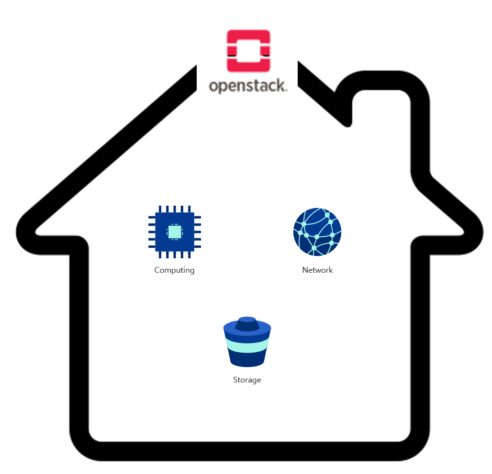

# Openstack Tenent 및 Identity 관리

 
<h2>목차</h2>

- Keystone은 무엇인가?
- Region / Domain / Project의 개념
 

---

 
<h2> Keystone은 무엇인가?</h2>

 

Keystone은 Openstack의 인증을 담당하고 있습니다.  
Openstack의 백엔드에서 **RBAD(Role Based Access Control)을** 통해 사용자의 접근을 제어하는 등의 인증(Identify) 서비스로 사용됩니다.  

어떤 서비스를 설치하더라도 가장 먼저 설치가 되는 가장 중요한 서비스이며, Keystone이 없으면 그 어떤 서비스도 이용할 수 없습니다.

 

따라서, 이렇게 생각을 해볼 수 있습니다.

 

Openstack이 집이라면 Keystone은 **현관문 키와 같은 기능**을 하는 것이 아닐까?  

 

Openstack이라는 집은 물리서버로 구성되어 있고, **집 안에는 Compute, Image, Network, Storage와 같은 자원들이 있다고 가정해봅시다.**

 

 

 

이러한 자원들이 우리가 평소에 사용하는 가전제품이라고 한다면  
Openstack이라는 집에 들어가야만 사용할 수 있습니다.

 

즉, 내돈내산 가전제품들을 집 주인과 손님만 사용할 수 있습니다.  
이렇듯 **Openstack이 제공하는 서비스들도 동일하게 아무나 사용할 수 없습니다.**

 

그렇기 때문에 집 주인과 손님이라는 인증을 받아야만 해당 가전제품(자원)들을 사용할 수 있는데,  
Keystone이 해당 부분을 담당하고 있다고 생각하면 이해가 편합니다.

 

**결과적으로 Keystone은 사용자 인증을 통하여 물리 서버내의 자원을 사용할 수 있도록 관리합니다.**

 
 
 

<h3>Logical Architecture로 보는 Keystone</h3>

 

이번에는 논리적인 구조를 통해 Keystone에 대해 한번 더 알아보겠습니다.  
* Keystone은 **서비스 및 관리자 API, Token Backend, Catalog Backend, Policy Backend, Identity Backend**의 구조로 되어 있습니다.

 

 

 

+ **Token Backend** : 사용자 별 Token 관리
+ **Catalog Backend** : Openstack 모든 서비스의 End-Point URL 관리
+ **Policy Backend** : Tenent, 사용자 계정 및 Role 등을 관리
+ **Identity Backend** : 전체적인 사용자 인증 관리

 
 

<h3>Keystone의 구성요소</h3>

**1. User**
   + 사람 또는 Openstack 서비스를 이용하는 서비스(nova, neutron, cinder 등)를 의미
   + User는 특정 프로젝트에 할당할 수 있으며, 중복을 허용하지 않음

**2. Authentication**
   + 사용자의 신분을 확인하는 절차로, 특정 값을 통해 Keystone이 이를 검증
   + 보통 인증을 위한 자료로는 ID, PW가 사용되며 Keystone은 인증확인 시 인증토큰을 발행

**3. Token**
   + RBAD의 신분을 증명하기 위해 사용되는 데이터
   + Token Type : uuid, fernet, pki, pkiz
   (참고 : https://docs.openstack.org/newton/admin-guide/identity-tokens.html)
   + Token Type에는 어떤 자원에 접근이 가능한지 범위가 지정되어 있음
 
 **4. Project**
 + dwawd
 
 
<h3>Openstack에서 Keystone의 위치</h3>

 

이번에는 Openstack에서 Keystone의 위치를 알아볼까 합니다.

 

 

 

Openstack에서 Keystone은 모든 서비스를 관장하는 위치에 자리잡고 있습니다.
 
**타인이나 해커로부터 시스템을 안전하게 보호하고, 사용자 등로 및 삭제, 권한 관리, 사용자가 접근할 수 있는 서비스 포인트 관리까지 사용자 인증에 대한 모든 관리**를 Keystone이 수행하고 있습니다.
<!--stackedit_data:
eyJoaXN0b3J5IjpbLTE4Mzk2NDAxNzUsMTk4MDA3MzA2NSwtMT
g1NzQwODQ4NCw0MTY1ODkxMTcsLTEzNDI0NTY5MTIsMjEyNjcx
NTEyMiwxNjIzNjg1NzYyLDY5OTEwNjM0MywxNDM4NDgxMzcyLD
E2NTQ3MzQ2NjksLTE2NTY1NDE2NzksNjQ5NzAzMDYsMjg0NTMz
NzU1LDM0MjM4MzIxMCwxMjEzNzUxNDQ0LDE1MDE3OTA4MzBdfQ
==
-->